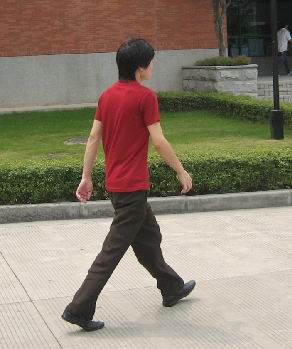

# ObjectDetection-Pytorch
## Object detection in pytorch using mask-rcnn fine tuning

In order to start first run bash command
> bash commands.sh

This will install all things we needed

### Data
Our data is PennFudanPed dataset. Which have some pedestrian images with their masks.

### Training
Run train.py file
> python3 train.py

In training you'll see losses, iuo_scores, confidence. After training you'll see an example like this:

Image

Mask

